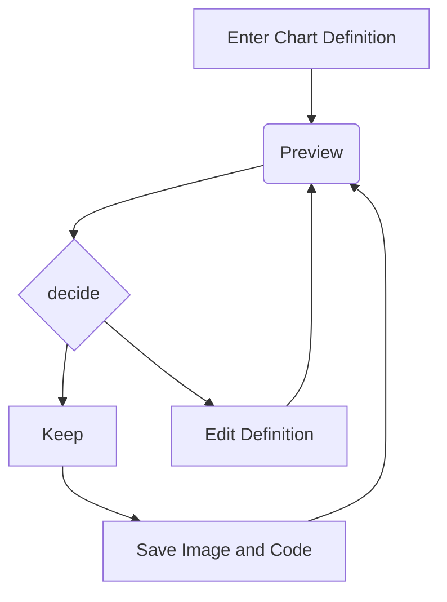
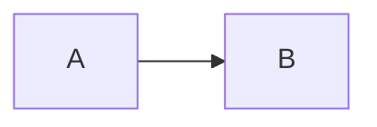
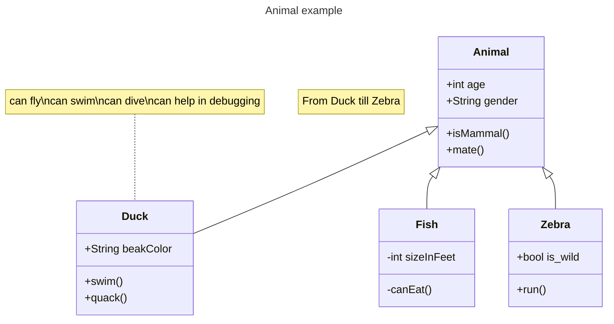
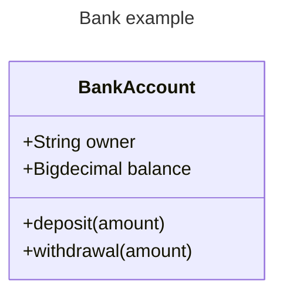
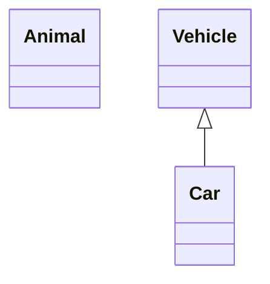

# Graph

``` mermaid
graph TD
    A[Enter Chart Definition] --> B(Preview)
    B --> C{decide}
    C --> D[Keep]
    C --> E[Edit Definition]
    E --> B
    D --> F[Save Image and Code]
    F --> B
```

# Flowchart

```mermaid
flowchart LR
  A --> B
```

## Class

``` mermaid
---
title: Animal example
---
classDiagram
    note "From Duck till Zebra"
    Animal <|-- Duck
    note for Duck "can fly\ncan swim\ncan dive\ncan help in debugging"
    Animal <|-- Fish
    Animal <|-- Zebra
    Animal : +int age
    Animal : +String gender
    Animal: +isMammal()
    Animal: +mate()
    class Duck{
        +String beakColor
        +swim()
        +quack()
    }
    class Fish{
        -int sizeInFeet
        -canEat()
    }
    class Zebra{
        +bool is_wild
        +run()
    }
```

``` mermaid
---
title: Bank example
---
classDiagram
    class BankAccount
    BankAccount : +String owner
    BankAccount : +Bigdecimal balance
    BankAccount : +deposit(amount)
    BankAccount : +withdrawal(amount)
```

``` mermaid
classDiagram
    class Animal
    Vehicle <|-- Car
```